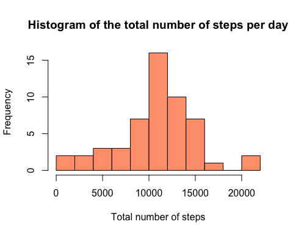
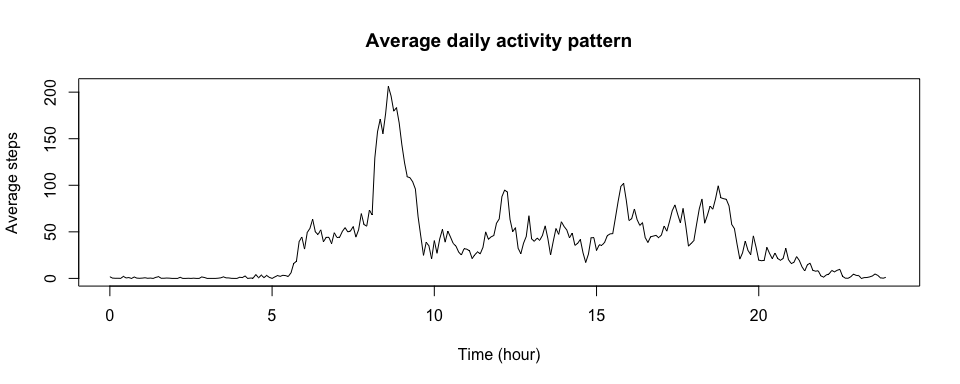
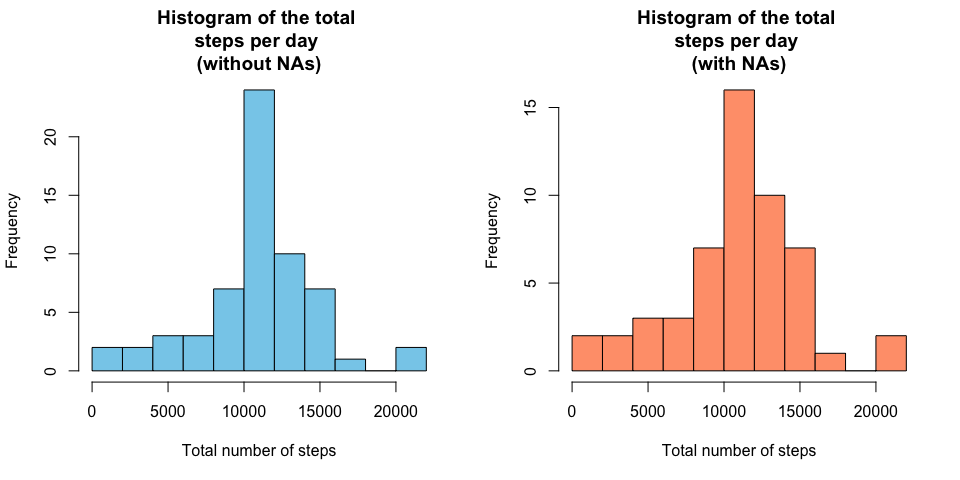
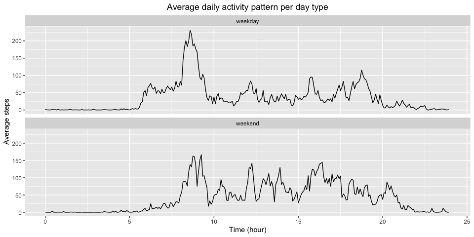

In this assignment, data collected from a personal activity monitoring device was used. Data was collected at 5 minute intervals through out the day, taken during the months of October and November 2012 from an anonymous individual, and include the number of steps done in each 5-minute interval. 

The packages used for this assignment are loaded below.


```r
library(dplyr)
library(ggplot2)
library(lubridate)
```

## Loading and preprocessing the data

First, the data needs to be loaded using the given url link in the assignement. If not already done, the file is unzipped, and the csv file is saved in the table `activity`. The dataframe has 17568 samples and 3 columns: 

- `steps` : integer variable which indicates the number of steps.

- `interval` : integer variable which identifies the 5-minute interval in which the number of steps were recorded.

- `date` : char variable which gives the day of the recording in format `YYYY-mm-dd`.


```r
# Load the data from the url if the data folder does not already exist in the correct folder
data_folder_name <- "repdata_data_activity.zip"
file_data_unzip <- "activity.csv"

# Unzip the data file if it is not already the case
if (!file.exists(data_folder_name)) {
      data_url <- "https://d396qusza40orc.cloudfront.net/repdata%2Fdata%2Factivity.zip"
      download.file(data_url, data_folder_name, method="curl")
}

# Unzip the data file if it is not already the case
if (!file.exists(file_data_unzip)) {
      unzip(data_folder_name)
}
```

Before analyzing the data in more details, some preprocessing actions are performed by creating new columns:

- A first column `date_time` in POSIXct `%Y-%m-%d %H%M` format is added, which combines the date of the column `date` and the time of the column `interval` converted into `HHMM` format. 

- Finally, a second column `total_minutes` is added. It is an integer variable that gives the total minutes of time that has passed until this data point, on that particular day. 


```r
activity <- read.csv("activity.csv")

# Convert the date column into POSIXct
activity$date_time <- strptime(paste(as.POSIXct(activity$date, format = "%Y-%m-%d"),
                                     sprintf("%04d", activity$interval)), 
                                 format = "%Y-%m-%d %H%M")
activity$total_minutes <- hour(activity$date_time)*60 + minute(activity$date_time)
```

## What is mean total number of steps taken per day?

A first analysis is done by studying the total number of steps per day. For this, the dataframe is grouped by `date` and the number of `steps` are summed together with the `summarise` method. The sum is saved in the dataframe `StepsPerDay_activity`. As per the instruction, the NAs values are ignored for now.

Below, the histogram showcases the distribution of the total number of steps per day. From the plot, one sees that most days, between 10000 and 12000 total steps are done by the subject.


```r
# Calculate the total number of steps per day
StepsPerDay_activity <- activity %>% 
      filter(!is.na(steps)) %>%
      group_by(date) %>% 
      summarise(total_sum = sum(steps, na.rm = TRUE))

# Plot the histogram of the total number of steps per day
hist(StepsPerDay_activity$total_sum, main = "Steps per day", xlab = "Steps", 
     ylab = "Frequency", col = "lightsalmon", breaks=10)
```

<!-- -->

In addition to the histogram, the mean and median of the total steps per day can be directly calculated.


```r
# Calculate the mean and median steps per day
MeanStepsDay <- mean(StepsPerDay_activity$total_sum, na.rm = TRUE)
MedianStepsDay <- median(StepsPerDay_activity$total_sum, na.rm = TRUE)

cat("The mean total steps per day is equal to", round(MeanStepsDay, 2), "\nThe median is equal to", MedianStepsDay)
```

```
## The mean total steps per day is equal to 10766.19 
## The median is equal to 10765
```

The mean total steps per day is equal to 10766.19, while the median is equal to 10765.

## What is the average daily activity pattern?

In this section, we want to get the average daily activity pattern of the subject. To this end, the `activity` dataframe is grouped by `total_minutes`, and the mean number of steps for each 5-minute interval is then calculated and saved in the `StepPerInterval_activity` dataframe. Again, the NAs values are filtered out for this part of the work. 

The subsequent average daily activity pattern is shown in the following time series graphic. From the plot, we observe that the average number of steps is close to 0 at the beginning of the day (0:00, 5:00), as well as its end (after 23:00), which probably corresponds to periods of time were the subject is sleeping. In particular, there seems to be a peak of activity between 8:00 and 9:00. 


```r
# Calculate the mean number of steps per 5 min interval
StepPerInterval_activity <- activity %>% 
      filter(!is.na(steps)) %>%
      group_by(total_minutes) %>% 
      summarise(mean = mean(steps, na.rm = TRUE))

# Plot the average daily activity pattern as a time series plot
plot(x = StepPerInterval_activity$total_minutes/60,
     y = StepPerInterval_activity$mean, 
     type="l",
     main = "Average daily activity pattern",
     xlab = "Time (hour)",
     ylab = "Average steps",
     xlim = c(0,24))
```

<!-- -->

The exact time interval where the number of steps is, in average, the highest, is calculated below.


```r
# Find the 5-min interval with the highest number of steps
MaxStepInterval <- max(StepPerInterval_activity$mean, na.rm = TRUE)
MaxInterval_TotalMinutes <- StepPerInterval_activity$total_minutes[which.max(StepPerInterval_activity$mean)]

# Converting the result into HH:MM
MaxInterval_hour <- MaxInterval_TotalMinutes %/% 60
MaxInterval_minute <- MaxInterval_TotalMinutes %% 60

cat("The peak activity is situated at the interval", MaxInterval_hour, MaxInterval_minute, "and is equal to", round(MaxStepInterval, 2), "steps")
```

```
## The peak activity is situated at the interval 8 35 and is equal to 206.17 steps
```

The peak of activity is situated at the time mark `MaxInterval_TotalMinutes` = 515 minutes, which, when converted into `HH:MM` format, corresponds to 8:35, i.e. the interval identifier is 835. This is probably correlated with the time at which the subject is going to work.

## Imputing missing values

In the previous sections, the NAs were ignored. Here, a strategy will be devised to fill in the missing values. First, we start to check the total number of NAs:


```r
# Get the total number of NA values
TotalNA <- sum(is.na(activity))

# from which all come from the steps column
NAsteps <- sum(is.na(activity$steps))

cat("Total number of missing values:", TotalNA, "\nNumber of missing values in the steps column:", NAsteps)
```

```
## Total number of missing values: 2304 
## Number of missing values in the steps column: 2304
```

There are a total of `TotalNA` = `NAsteps` = 2304 values missing in the dataframe, all of them present in the `steps` column.

To fill the NA values, the following strategy will be employed: The missing values will be replaced by the mean values calculated for each 5-minute interval across all days. In my opinion, it is a better representation of the number of steps made in that particular 5-min interval than using the mean/median of that particular day. For example, if the interval is situated at the beginning of the day, the person is sleeping and the number of steps will therefore be close to 0. In addition, some days of the dataset have NAs for the whole day, making the mean/median value per day strategy difficult to apply.

After filling in the NAs, the histogram of the total number of steps per day is plotted in blue. For a better comparison, the previous histogram, where the NAs were ignored, is also displayed in red.


```r
# Fill the NA values present in the steps column in a new dataframe
activity_filledNA <- activity %>%
      group_by(total_minutes) %>%
      mutate(steps = ifelse(is.na(steps), StepPerInterval_activity$mean[StepPerInterval_activity$total_minutes == first(total_minutes)], steps)) %>%
      ungroup()

# Get the total number of NA values
TotalNA_new <- sum(is.na(activity_filledNA))

cat("Total number of missing values in the new dataframe is:", TotalNA_new)
```

```
## Total number of missing values in the new dataframe is: 0
```

```r
# Calculate the total number of steps per day
StepsPerDay_activity_filledNA <- activity_filledNA %>% 
      group_by(date) %>% 
      summarise(total_sum = sum(steps))

# Plot the histogram of the total number of steps per day
par(mfrow = c(1, 2))
hist(StepsPerDay_activity_filledNA$total_sum, main = "Steps per day \n(without NAs)", xlab = "Steps", 
     ylab = "Frequency", col = "skyblue", breaks=10)
hist(StepsPerDay_activity$total_sum, main = "Steps per day \n(with NAs)", xlab = "Steps", 
     ylab = "Frequency", col = "lightsalmon", breaks=10)
```

<!-- -->

The bin which had already the highest frequency with the NAs (red) increased in the new histogram (blue), while the other bins stayed at the same height. This is expected, since we used the mean value to replace the NAs, therefore we see an increase in frequency of the bin containing the mean value too.


```r
# Calculate the mean and median steps per day
MeanStepsDay_filledNA <- mean(StepsPerDay_activity_filledNA$total_sum)
MedianStepsDay_filledNA <- median(StepsPerDay_activity_filledNA$total_sum)

cat("The mean total steps per day is equal to", MeanStepsDay_filledNA, "\nThe median is equal to", MedianStepsDay_filledNA)
```

```
## The mean total steps per day is equal to 10766.19 
## The median is equal to 10766.19
```

After filling the NAs, the mean total steps per day value is equal to 10766.19, the same as previously (since we used the mean to fill in the missing values). As for the new median value, equal to 10766.19, it is almost the same to the previous median value, and is now equal to the mean.

Using the mean value of steps for a particular 5-min interval to deal with NAs values will naturally skew the results towards the mean value of total steps. 

## Are there differences in activity patterns between weekdays and weekends?

In this final part of the work, we will again plot the average daily activity pattern, but this time we will distinguish between weekdays and weekends. To achieve this, a new factor variable is added as the column `day_type` to the `activity_filledNA` dataframe. The variable takes either the value `weekend` if the current day is a Saturday or Sunday, or the value `weekday` for every other day of the week.


```r
# Create a new column day_type which takes value "weekend" or "weekday", depending
# on the day type of the date
activity_filledNA <- activity_filledNA %>%
      mutate(day_type = ifelse(weekdays(date_time) == "Saturday" |
                   weekdays(date_time) == "Sunday", "weekend", "weekday"))
```

Similarly to before, we then calculate the average number of steps for each interval, but this time by separating the weekdays from the weekends. The dataframe is therefore grouped by `total_times` but also by `day_type`. A time series plot is done for each case below, to visualize the average daily activity pattern per day type. 

Comparing the curves between each other, it is possible to observe some differences between the patterns. Indeed, during weekdays, the activity clearly starts around 5:30, while on weekends it starts around 8:00, showing that the subject generally sleeps longer on weekends. In addition, there is a great peak of activity at 8:30 which then slows during the afternoon for weekdays. For weekends, the peak of activity at 8:30 is smaller, but the global activity during the afternoon seems to be slightly higher. The subject does maybe more various activities during weekends (jogging, walk) than during weekdays, where the person will be occupied by work, maybe sitting in an office.


```r
# Calculate the average steps per 5 minute interval depending on the day type
StepPerInterval_activity_filledNA <- activity_filledNA %>% 
      group_by(total_minutes, day_type) %>% 
      summarise(mean = mean(steps, na.rm = TRUE))

# Create the time series panel plot, one curve for the weekday category, and
# another one for the weekend category
ggplot(StepPerInterval_activity_filledNA, aes(x = total_minutes/60, y = mean)) +
      geom_line() +
      facet_wrap(~ day_type, ncol = 1) +
      labs(title = "Average daily activity pattern per day type",
           x = "Time (hour)",
           y = "Average steps") +
      theme(plot.title = element_text(hjust = 0.5))+
      coord_cartesian(xlim = c(0, 24))
```

<!-- -->
